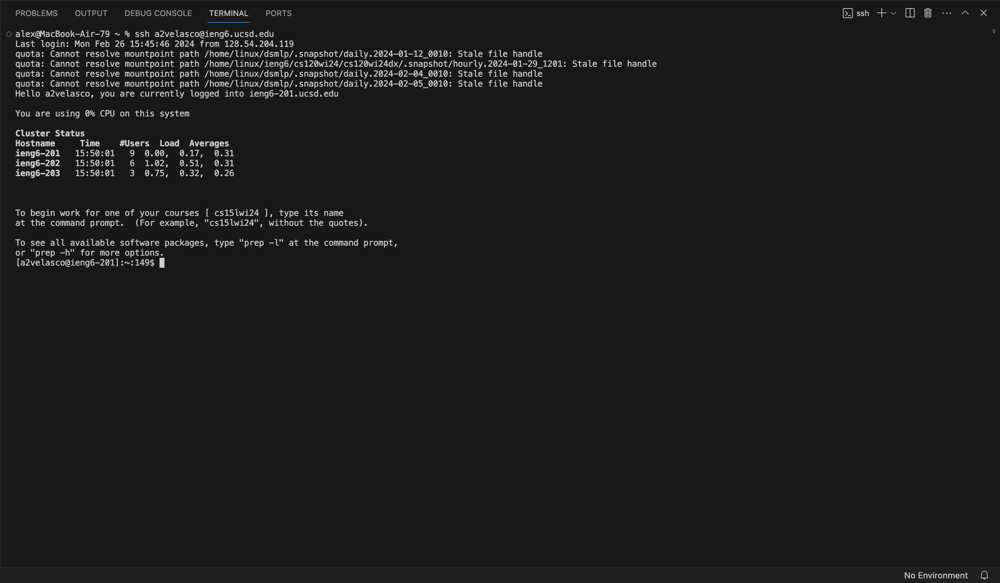
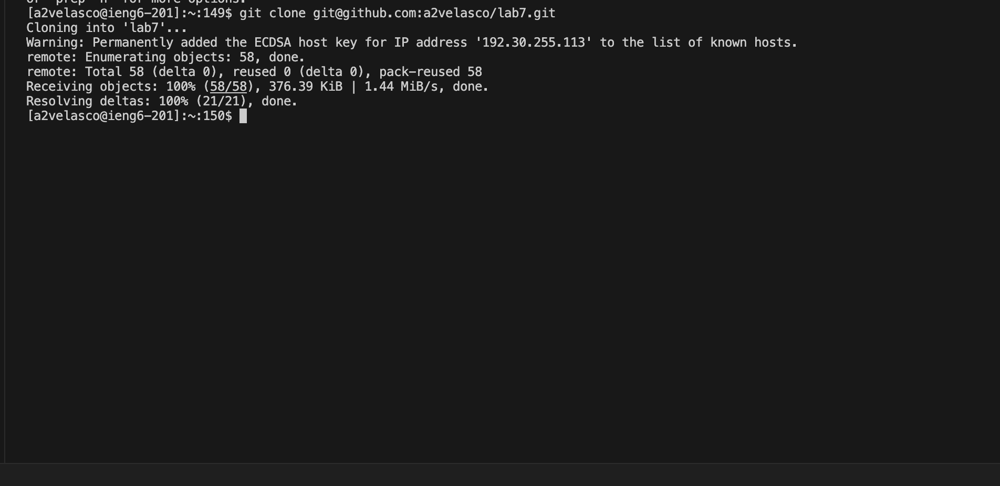
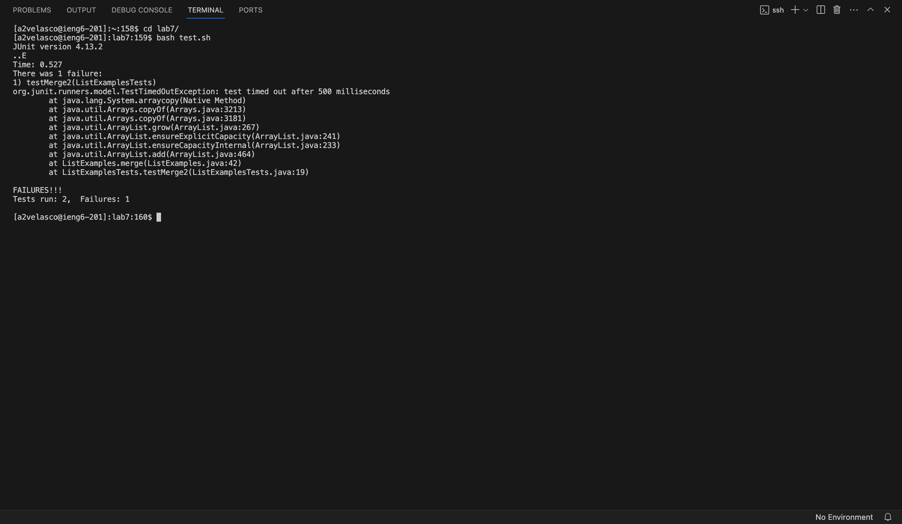
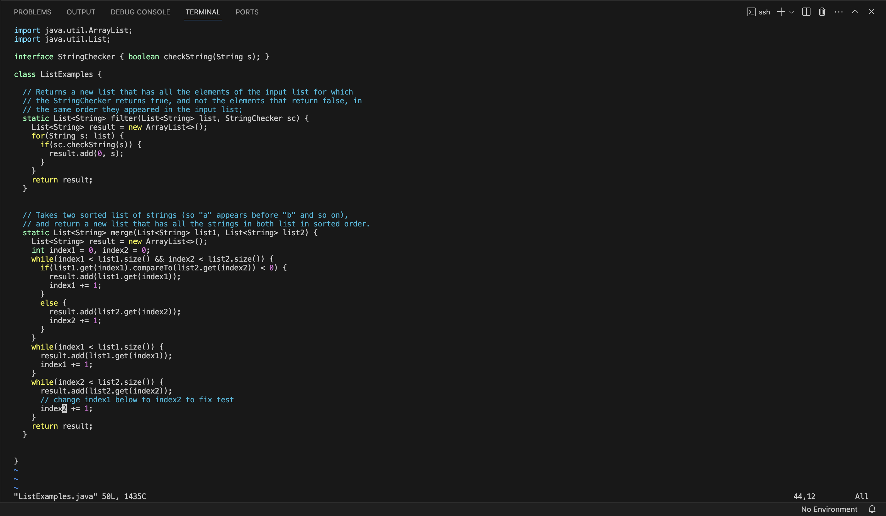

# Lab Report 4
## Step 1: Log into ieng6

Keys pressed: ```<up><up><enter>```. The ```ssh a2velasco@ieng6.ucsd.edu``` command was up two in the bash history.
## Step 2: Clone my fork of the repository

Keys pressed: ```<g><i><t><space><c><l><o><tab><ctrl+p><enter>```. Tab autocompletes clone and I pasted ```git@github.com:a2velasco/lab7.git``` from copying the link from github. 
## Step 3: Run the failing tests

Keys pressed: ```<c><d><space><l><tab><enter>```. Change to lab7 directory using tab to autocomplete the path.

Keys pressed: ```<b><a><s><h><space><t><tab><enter>```. Run the failing tests and use tab to autocomplete ```test.sh```.
## Step 4: Edit code to fix test

Keys pressed: ```<v><i><space><L><tab><.><j><tab><enter>```. Enter vim to edit the file.

Keys pressed: ```<:><4><4><enter><e><r><2><:><w><q>```. Jump to the line where the error is and replace the 1 with a 2, then save and quit.
## Step 5: Run the fixed tests

Keys pressed: ```<up><up><enter>```. The ```bash test.sh``` command was up two in the bash history.
